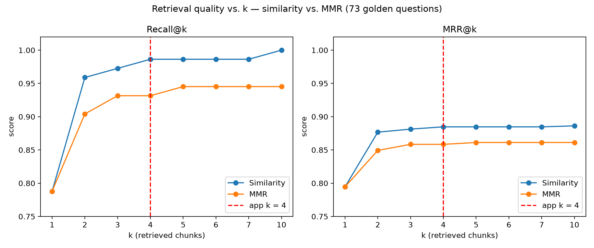
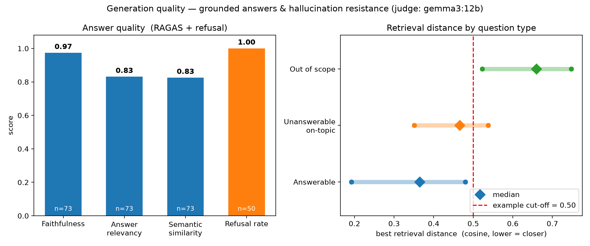

# 📖 AskMyThesis

A bilingual (Portuguese and English) **retrieval-augmented generation (RAG)** assistant that answers questions about a master's thesis, grounded strictly in the document. Ask in either language and get an answer in that same language, with the thesis sections it was drawn from cited underneath. If the thesis does not cover the question, the assistant says so rather than inventing an answer.

The project is built end to end: PDF preprocessing, chunking, embedding and indexing, retrieval, grounded generation, a full evaluation suite (retrieval and generation), and a Streamlit chat UI.

It was presented as the final project for the **EDIT. - Deep Learning with TensorFlow** bootcamp.

---

## Highlights

- **Bilingual, grounded answers.** European Portuguese and English, answered only from retrieved context, with section citations.
- **Refusal by design.** Out-of-scope and unanswerable questions are declined, in the question's language, measured at 100% refusal on 50 negative test cases.
- **Evaluate locally, deploy in the cloud.** A single backend switch runs the same model locally (Ollama) for free, reproducible evaluation and on Hugging Face Inference for deployment, so local evaluation genuinely predicts production behaviour.
- **Rigorously evaluated.** Retrieval (recall@k, hit@k, MRR) and generation (RAGAS faithfulness, answer relevancy, semantic similarity, plus a refusal check) both scored against a hand-built golden set.

---

## Architecture


The same flow, mapped to the scripts:

```
                        PREPROCESSING (offline, one-time)
  thesis.pdf ──► extract_text.py ──► clean_text.py ──► chunking.py ──► indexing.py
                 (sections+meta)      (dehyphenate,     (recursive,     (bge-m3 →
                                       reflow)           token-aware)    Chroma)

                        SERVING (per question)
  question ──► Retriever (bge-m3 + Chroma) ──► Generator (grounded prompt → LLM) ──► answer + cited sources
                                                              │
                                          ollama (local/eval)  or  hf (deploy)
```

| Stage | Component | Choice |
|-------|-----------|--------|
| Embeddings / retrieval | `bge-m3` (BAAI) in a persisted **Chroma** collection, cosine distance | Strong multilingual embeddings for a PT/EN corpus |
| Generation | **Qwen2.5-7B-Instruct** | Runs locally as `qwen2.5:7b` (Ollama) and hosted as `Qwen/Qwen2.5-7B-Instruct` (HF), the same model on both sides |
| Eval judge | `gemma3:12b` (local Ollama) | Free and deterministic, and from a different model family than the generator, which avoids self-preference bias |

---

## Repository layout

```
AskMyThesis/
├── app.py                          # Streamlit chat UI
├── config.yaml                     # run configuration (paths, models, chunking, retrieval, eval)
├── src/
│   ├── config.py                   # loads config.yaml (or --config / ASKMYTHESIS_CONFIG)
│   ├── preprocessing/
│   │   ├── extract_text.py         # Stage 1: PDF → structured sections + metadata
│   │   └── clean_text.py           # Stage 2: dehyphenate, reflow paragraphs, normalize
│   ├── chunking.py                 # Stage 3: sections → token-aware chunks (title-prepended)
│   ├── indexing.py                 # Stage 4: embed chunks (bge-m3) → persisted Chroma index
│   ├── retrieval.py                # Query the index (similarity / MMR), returns scored dicts
│   ├── generation.py               # Retrieve → grounded prompt → LLM (ollama | hf backend)
│   └── evaluation/
│       ├── evaluate_retrieval.py   # recall@k / hit@k / MRR vs the golden set
│       ├── evaluate_generation.py  # RAGAS + refusal + distance-by-type checks
│       └── plot_evals.py           # draws all eval charts from the saved reports
├── assets/architecture.png         # architecture diagram
├── data/
│   ├── raw/thesis.pdf              # source document
│   ├── processed/                  # extracted_sections / cleaned_sections / chunks (JSON)
│   ├── golden/golden.json          # hand-built eval set
│   └── chroma/                     # persisted vector index
├── evals/
│   ├── retrieval/                  # retrieval results (CSV) + charts
│   └── generation/                 # generation results (JSON/CSV), answer cache + charts
├── notebooks/                      # profiling & exploration (sections, chunks, indexing)
├── pyproject.toml                  # project metadata + pinned direct dependencies (uv)
└── uv.lock                         # fully resolved lockfile
```

---

## Setup

**Prerequisites**
- [uv](https://docs.astral.sh/uv/) (installs Python 3.12 automatically, pinned in `.python-version`)
- [Ollama](https://ollama.com/), for local generation and evaluation
- A Hugging Face token, only for the hosted (`hf`) generation backend

```bash
# 1. Create the virtual environment (.venv) and install dependencies from uv.lock
uv sync                       # add `--group notebooks` for the profiling notebooks
source .venv/bin/activate     # or prefix commands with `uv run`

# 2. Pull the models used locally (generation + eval judge)
ollama pull qwen2.5:7b     # generation (qwen2.5:3b works if RAM is tight)
ollama pull gemma3:12b     # eval judge (only needed for generation eval)

# 3. (Optional) configure the hosted backend for deployment
echo "HUGGINGFACEHUB_API_TOKEN=hf_xxx" > .env
```

`bge-m3` (about 2 GB) downloads automatically from Hugging Face the first time the index is built or queried.

---

## Configuration

Run settings live in [`config.yaml`](config.yaml), not in the scripts: file paths, PDF page range, embedding model, chunk size/overlap, retrieval `k` / search type, generation backend and models, and the evaluation sweep, judge and RAGAS settings. Every script reads it.

To try a variant without editing the default, write a YAML file with only the keys you want to change and pass it with `--config`:

```yaml
# configs/quick.yaml
eval:
  generation:
    sample: 5
    use_cache: false
```

```bash
python src/evaluation/evaluate_generation.py --config configs/quick.yaml
streamlit run app.py -- --config configs/quick.yaml     # note the extra `--`
ASKMYTHESIS_CONFIG=configs/quick.yaml python src/chunking.py   # env var works too
```

Missing keys fall back to the defaults in `src/config.py`. Unknown keys raise an error, so a typo can't silently fall back to a default. Relative paths are resolved from the repo root. Prompts, text-cleaning rules and secrets are deliberately not configurable: prompts and cleaning rules are part of the evaluated method and stay in code, and secrets stay in `.env`.

---

## Build the index

The index is a deterministic function of the source PDF. Run the pipeline from the repo root:

```bash
python src/preprocessing/extract_text.py   # thesis.pdf → extracted_sections.json
python src/preprocessing/clean_text.py     # → cleaned_sections.json
python src/chunking.py                     # → chunks.json  (recursive, ~500-token chunks)
python src/indexing.py                     # → data/chroma/  (bge-m3 embeddings)
```

`indexing.py` wipes and rebuilds the Chroma collection on each run, stamping the embedding model and chunk size into the collection metadata. `retrieval.py` refuses to load an index built with a mismatched embedding model, so query and index can never silently diverge.

---

## Run the app

```bash
streamlit run app.py
```

This opens a chat UI: ask in Portuguese or English, read the grounded answer as it streams in, and expand **Sources** to see the cited thesis sections (with retrieval distances). The app retrieves the top 4 chunks per question (`retrieval.k`). Retrieval runs locally; generation goes through the configured backend.

Smoke tests without the UI:

```bash
python src/retrieval.py     # prints top sections for a sample query (similarity + MMR)
python src/generation.py    # answers a couple of sample questions with citations
```

---

## Generation backends

`generation.py` selects its LLM via `generation.backend` in the config, which the `LLM_BACKEND` environment variable overrides (handy for deployment):

| `LLM_BACKEND` | Model | Use |
|---------------|-------|-----|
| `ollama` (default) | local `qwen2.5:7b` | Evaluation and local dev: free, offline, deterministic |
| `hf` | `Qwen/Qwen2.5-7B-Instruct` via HF Inference | Deployment: no local weights load, needs `HUGGINGFACEHUB_API_TOKEN` |

Both backends are greedy (`temperature=0`) for reproducibility, and both run the same underlying model, which is the whole point: what is measured locally is what ships. The evaluation scripts pin `backend="ollama"` regardless of the environment variable. The HF backend maps API failures (quota, rate-limit, model-loading) to clean bilingual user messages instead of stack traces.

---

## Evaluation

Everything is scored against `data/golden/golden.json`, a hand-built set of **123 questions** (84 PT / 39 EN):

| Type | Count | Purpose |
|------|-------|---------|
| `answerable` | 73 | Questions the thesis answers, each with relevant section labels and a reference answer |
| `out_of_scope` | 27 | Off-topic, should be declined |
| `unanswerable_on_topic` | 23 | On-topic but not actually answered in the thesis, the hard hallucination case |

### Retrieval

```bash
python src/evaluation/evaluate_retrieval.py
```

Sweeps `k` and search type (similarity vs MMR), reporting recall@k, hit@k, and MRR with a per-language breakdown, saved with its charts to `evals/retrieval/` (`retrieval_eval.csv`, `retrieval_eval_by_lang.csv`). Entirely local, no LLM and no API cost. It uses section-prefix matching, so a `2.3.1` chunk credits a `2.3` label.

Results (similarity):

| k | hit@k | recall@k | MRR |
|---|-------|----------|-----|
| 1 | 0.79 | 0.79 | 0.79 |
| 3 | 0.97 | 0.97 | 0.88 |
| **5** | **0.99** | **0.99** | **0.88** |
| 10 | 1.00 | 1.00 | 0.89 |

Similarity beats MMR at every k above 1 (they tie at k=1) on this corpus, and retrieval is near-saturated by k=5.



### Generation

```bash
python src/evaluation/evaluate_generation.py
```

Runs three checks, all local (`gemma3:12b` judge on Ollama, and bge-m3):

1. **Refusal** on the 50 negatives: does the assistant correctly decline? A yes/no judge decides. `unanswerable_on_topic` is the real hallucination-resistance test, since on-topic context is retrieved but holds no answer.
2. **Retrieval distance by type**: shows that a distance cutoff could screen `out_of_scope` but not `unanswerable_on_topic`, which is why check 1 exists.
3. **RAGAS** on the answerable questions: faithfulness and answer relevancy (vs retrieved context) and semantic similarity (vs the reference answer).

Answers are cached to `evals/generation/answers_cache.json`, keyed by a signature of the model and system prompt, and the cache auto-invalidates when either changes. A full run takes about 2.5 hours, mostly RAGAS on the local judge.

Results (judge `gemma3:12b`):

| Metric | Score |
|--------|-------|
| Faithfulness | 0.97 |
| Answer relevancy | 0.83 |
| Semantic similarity | 0.83 |
| Refusal, out_of_scope | **27 / 27 (100%)** |
| Refusal, unanswerable_on_topic | **23 / 23 (100%)** |



Outputs land in `evals/generation/` (`generation_eval.json`, `ragas_per_row.csv`, charts). Redraw all the charts (retrieval and generation) from the saved reports in seconds, without loading any model, with `uv run --group notebooks python src/evaluation/plot_evals.py`. `factual_correctness` is disabled by default, since its claim-decomposition step needs strict JSON the earlier `qwen2.5:14b` judge could not emit reliably. It has not been retried with `gemma3:12b`, and can be re-enabled in `eval.generation.ragas_metrics`.

**Why a judge from a different family.** LLM judges tend to rate text from their own model family more favourably (self-preference bias). [Pombal et al. (2026)](https://arxiv.org/abs/2604.06996) show this holds even for binary yes/no verdicts on objective criteria. The first judge, `qwen2.5:14b`, was from the same family as the generator (`qwen2.5:7b`), so I re-scored the same cached answers with Google's `gemma3:12b` and made it the default judge. It scored them no lower (faithfulness 0.95 → 0.97, answer relevancy 0.82 → 0.83, refusal 100% under both), so the earlier results were not inflated by self-preference. The two judges agreed on the averages but only moderately on individual answers, so a single answer's score depends on the judge. Any other Ollama model can be used as the judge by changing `eval.generation.judge_model`. A hosted judge would need a small code change in `get_judge()`.

---

## How grounding works

The system prompt binds the model to a few rules: answer only from the provided context, decline briefly when the context does not cover the question, and reply in the question's language. Because a Portuguese context pulls a small model toward answering in Portuguese even for English questions, the reply language is detected deterministically (`langdetect`) and forced via a directive placed right next to the question, rather than trusting the model to pick it.

---

## What I learned

- **Build the evaluation set before tuning anything.** The hand-built golden set showed that retrieval was nearly saturated by k=5, so further effort belonged in generation, not in more retrieval tweaks.
- **Negative questions matter as much as answerable ones.** A retrieval-distance cutoff screens off-topic questions but not on-topic ones the thesis never answers. Only an explicit `unanswerable_on_topic` set shows whether the model hallucinates.
- **Don't trust a small model with what code can do deterministically.** The 7B model drifted into Portuguese on English questions and declined in English by default, so the reply language is now detected in code and forced in the prompt.
- **A RAG system only knows what is in its chunks.** The assistant could not say who wrote the thesis until I added a synthetic front-matter section with the title, author and supervisors.
- **Simpler can win.** Plain similarity search beat MMR at every k on this corpus.
- **The judge is part of the measurement.** The first local judge could not reliably produce the strict JSON that `factual_correctness` needs, and small RAGAS differences (under about 0.02) are judge noise. Swapping in a judge from a different family tested for self-preference bias: the averages held, but scores for individual answers shifted, so a judge's verdict on a single answer shouldn't be over-read.
- **Evaluate what you ship.** Running the same model locally for evaluation and hosted for deployment keeps the evaluation results meaningful for production.
- **Make results reproducible and stale state impossible.** A lockfile, one config file, an answer cache keyed by model and prompt, and an index stamped with its embedding model mean old results or a mismatched index can't slip through unnoticed.
